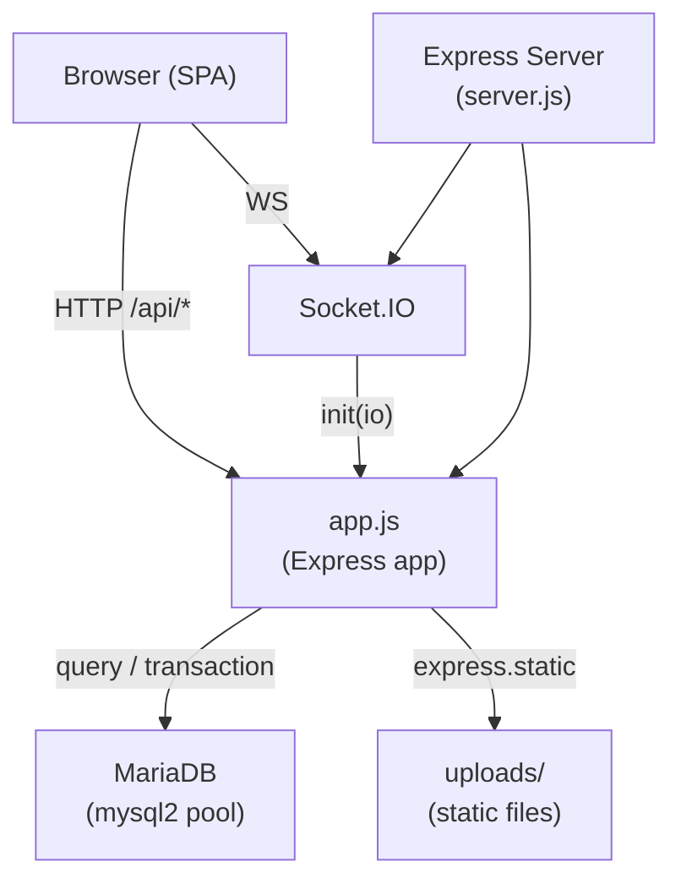

# Design Document: WisataPass Refactor

## Overview

WisataPass is an online tourist attraction ticketing platform. This refactor migrates the database from PostgreSQL to MariaDB, reorganizes the project into a `backend/` + `frontend/` monorepo, adds a full QR management subsystem, and brings the application to production readiness.

The system already has a working backend core and frontend SPA. The design below covers the full intended state — describing what is already built and what must still be completed.

**Key constraints inherited from the existing implementation:**
- Single Express server serves both `/api/*` and static frontend from `frontend/public/`
- Hash-based SPA routing (`#/admin/qr`, `#/admin/gate`, etc.)
- `mysql2/promise` with `?` positional placeholders throughout
- No separate build step for the frontend — plain ES6 modules loaded via `<script type="module">`
- Socket.IO for realtime events; JWT for stateless auth

---

## Architecture



### Layers

| Layer | Location | Responsibility |
|---|---|---|
| Entry point | `backend/server.js` | HTTP server, Socket.IO init, scheduled jobs, graceful shutdown |
| Express app | `backend/src/app.js` | Middleware chain, route mounts, SPA fallback, health check |
| Config | `backend/src/config/` | DB pool, JWT helpers, Multer |
| Modules | `backend/src/modules/{domain}/` | Controller → Model pattern per domain |
| Middleware | `backend/src/middleware/` | Auth, error handler, audit log, validation runner |
| Sockets | `backend/src/sockets/socketService.js` | Singleton Socket.IO wrapper with domain event helpers |
| Utils | `backend/src/utils/` | Logger (Winston), response helpers, pagination, sanitize |
| Frontend | `frontend/public/` | Static SPA: HTML shell, CSS, ES6 module JS |

### Request Lifecycle

```
Browser
  └─ fetch /api/admin/qr/scan
       └─ Express pipeline
            ├─ helmet (security headers)
            ├─ cors
            ├─ rateLimit (100/min on scan endpoint)
            ├─ express.json()
            ├─ morgan (access log)
            ├─ authenticate (JWT → req.user)
            ├─ authorize / requirePermission('qr:scan')
            ├─ validate (express-validator)
            ├─ qrController.scan()
            │    ├─ qrService.verifyQR()       [crypto, pure]
            │    ├─ QRModel.findByUuid()        [DB read]
            │    ├─ QRModel.incrementScanCount() [DB write]
            │    ├─ QRModel.logScan()            [DB insert]
            │    └─ socketSvc.onQRScanned()      [WS broadcast]
            └─ errorHandler (catches thrown errors)
```

---

## Components and Interfaces

### Backend Module Map

```
backend/src/modules/
├── auth/
│   ├── authController.js    ✅ complete
│   └── authRoutes.js        ✅ complete
├── users/
│   ├── UserModel.js         ✅ complete
│   ├── userController.js    ❌ missing — admin user management CRUD
│   └── userRoutes.js        ❌ missing
├── admin/
│   ├── SiteModel.js         ✅ complete
│   ├── siteController.js    ✅ complete
│   ├── siteRoutes.js        ✅ complete
│   ├── promotionController.js ❌ missing
│   ├── promotionRoutes.js   ❌ missing
│   ├── reviewController.js  ❌ missing
│   ├── reviewRoutes.js      ❌ missing
│   ├── notificationController.js ❌ missing
│   ├── notificationRoutes.js ❌ missing
│   ├── customerController.js ❌ missing
│   ├── customerRoutes.js    ❌ missing
│   ├── branchController.js  ❌ missing
│   └── branchRoutes.js      ❌ missing
├── tickets/
│   ├── TicketModel.js       ✅ complete
│   ├── ticketController.js  ✅ complete
│   ├── ticketRoutes.js      ✅ complete
│   ├── OrderModel.js        ✅ complete
│   ├── orderController.js   ✅ complete
│   └── orderRoutes.js       ✅ complete
├── qr/
│   ├── qrModel.js           ✅ complete
│   ├── qrService.js         ✅ complete
│   ├── qrController.js      ✅ complete
│   └── qrRoutes.js          ✅ complete
├── payment/
│   ├── paymentController.js ✅ complete
│   └── paymentRoutes.js     ✅ complete
├── dashboard/
│   ├── dashboardController.js ✅ complete
│   └── dashboardRoutes.js   ✅ complete
├── reports/
│   ├── reportController.js  ✅ complete
│   └── reportRoutes.js      ✅ complete
└── settings/
    ├── settingsController.js ❌ missing
    └── settingsRoutes.js    ❌ missing
```

### Controller → Model Pattern

Every domain module follows the same three-layer pattern:

```
Route file  →  Controller  →  Model
(validation,   (orchestrates  (pure DB
 auth guards)   business logic) queries)
```

**Route file** responsibilities:
- Mount `express.Router()`
- Apply `authenticate`, `authorize`/`requirePermission`, `validate` middleware
- Map HTTP verbs + paths to controller methods

**Controller** responsibilities:
- Extract and validate request data
- Call Model and Service methods
- Emit Socket.IO events via `socketSvc`
- Write audit log entries
- Return standardized responses via `success()` / `error()` helpers

**Model** responsibilities:
- Execute parameterized SQL via `query()`, `transaction()`, or `execute()`
- Return plain JS objects (no HTTP concerns)
- Handle soft-delete filtering (`WHERE deleted_at IS NULL`)

### Missing Modules — Interface Contracts

#### `userController.js` / `userRoutes.js`

```
GET    /api/users              — list users (paginated, searchable)
GET    /api/users/:id          — user detail
PUT    /api/users/:id          — update user (role, is_active, full_name)
PUT    /api/users/:id/activate — set is_active = 1
PUT    /api/users/:id/deactivate — set is_active = 0
```

Auth guard: `requirePermission('user:manage')`

#### `promotionController.js` / `promotionRoutes.js`

```
GET    /api/promotions          — list promotions (public + admin)
GET    /api/promotions/:id      — promotion detail
POST   /api/promotions          — create promotion [admin]
PUT    /api/promotions/:id      — update promotion [admin]
DELETE /api/promotions/:id      — soft delete [admin]
POST   /api/promotions/validate-code — check promo code validity
```

#### `notificationController.js` / `notificationRoutes.js`

```
GET    /api/notifications         — list (filtered by req.user.id)
GET    /api/notifications/unread-count
PUT    /api/notifications/:id/read
PUT    /api/notifications/read-all
POST   /api/notifications         — create [admin only]
```

#### `customerController.js` / `customerRoutes.js`

```
GET    /api/customers             — list customers [admin]
GET    /api/customers/:id         — customer detail + bookings summary
PUT    /api/customers/:id         — update customer profile
PUT    /api/customers/:id/activate
PUT    /api/customers/:id/deactivate
```

#### `branchController.js` / `branchRoutes.js`

```
GET    /api/branches              — list branches (optionally filter by site)
GET    /api/branches/:id          — branch detail
POST   /api/branches              — create branch [admin]
PUT    /api/branches/:id          — update branch [admin]
DELETE /api/branches/:id          — soft delete [admin]
```

#### `settingsController.js` / `settingsRoutes.js`

```
GET    /api/settings              — list all settings [owner/super_admin]
GET    /api/settings/:key         — single setting value
PUT    /api/settings/:key         — update setting value [owner/super_admin]
```

Auth guard: `requirePermission('settings:manage')`

#### `/api/health` endpoint

```javascript
app.get('/api/health', async (req, res) => {
  const start = Date.now();
  let dbStatus = 'disconnected';
  try { await pool.query('SELECT 1'); dbStatus = 'connected'; } catch (_) {}
  res.json({
    status: 'ok',
    db: dbStatus,
    uptime: process.uptime(),
    timestamp: new Date().toISOString(),
    responseTime: `${Date.now() - start}ms`,
  });
});
```

### Auth Middleware Chain

```
authenticate(req, res, next)
  ├─ Extract Bearer token from Authorization header
  ├─ jwt.verify(token, JWT_SECRET) → decoded.userId
  ├─ SELECT u.*, r.name AS role FROM users u JOIN roles r WHERE u.id = ?
  ├─ Attach req.user = { id, username, email, full_name, role, role_id, is_active }
  └─ next()

authorize(...roles)           — checks req.user.role is in the allowed list
requireLevel(minRole)         — checks numeric hierarchy level
requirePermission(permission) — [to be implemented] queries role_permissions JOIN
```

`requirePermission` factory (needs implementation):

```javascript
function requirePermission(permission) {
  return async (req, res, next) => {
    const rows = await query(
      `SELECT 1 FROM role_permissions rp
       JOIN permissions p ON p.id = rp.permission_id
       WHERE rp.role_id = ? AND p.name = ?`,
      [req.user.role_id, permission]
    );
    if (!rows.length) {
      return res.status(403).json({ success: false, message: 'Insufficient permissions.' });
    }
    next();
  };
}
```

### Socket.IO Room Architecture

| Room | Members | Events received |
|---|---|---|
| `admins` | owner, super_admin, admin | `qr:generated`, `qr:scanned`, `booking:created`, `booking:cancelled`, `payment:success`, `visitor:entry`, `dashboard:refresh` |
| `gate` | gate_officer | `qr:scanned` |
| `user:{userId}` | any authenticated user | `booking:created`, `booking:confirmed`, `booking:cancelled`, `ticket:used`, `notification:new`, `payment:success` |
| `branch:{branchId}` | gate officers who emit `join:branch` | `qr:scanned` |

Connection authentication: JWT passed via `socket.handshake.auth.token` or `socket.handshake.query.token`. Connections without a valid token proceed as anonymous and join no rooms.

---

## Data Models

### Core Tables (already migrated)

```sql
-- roles
id INT AUTO_INCREMENT PK
name VARCHAR(50) UNIQUE NOT NULL   -- owner, super_admin, admin, cashier, gate_officer, marketing, viewer
description TEXT
created_at DATETIME(3)

-- permissions
id INT AUTO_INCREMENT PK
name VARCHAR(100) UNIQUE NOT NULL  -- qr:generate, qr:scan, booking:confirm, ...
description TEXT
created_at DATETIME(3)

-- role_permissions
role_id INT FK roles(id)
permission_id INT FK permissions(id)
PRIMARY KEY (role_id, permission_id)

-- users
id CHAR(36) PK DEFAULT (UUID())
role_id INT FK roles(id)
username VARCHAR(100) UNIQUE
email VARCHAR(255) UNIQUE NOT NULL
password_hash VARCHAR(255) NOT NULL
full_name VARCHAR(255)
phone VARCHAR(30)
avatar VARCHAR(500)
is_active TINYINT(1) DEFAULT 1
last_login_at DATETIME(3)
deleted_at DATETIME(3)
created_at DATETIME(3) DEFAULT CURRENT_TIMESTAMP(3)
updated_at DATETIME(3) ON UPDATE CURRENT_TIMESTAMP(3)
```

### QR Subsystem Tables

```sql
-- qr_codes
id CHAR(36) PK
uuid VARCHAR(36) UNIQUE NOT NULL
ticket_id CHAR(36) FK tickets(id) NULL
order_id CHAR(36) FK ticket_orders(id) NULL
site_id CHAR(36) FK tourist_sites(id) NULL
branch_id CHAR(36) FK branches(id) NULL
generated_by CHAR(36) FK users(id)
qr_image LONGTEXT              -- base64 PNG data URL
qr_data TEXT                   -- raw JSON string encoded in QR image
payload_hash VARCHAR(64)       -- SHA-256 of encrypted data
signature VARCHAR(64)          -- HMAC-SHA256 hex
status ENUM('active','used','expired','deactivated','deleted')
max_scans INT DEFAULT 1
scan_count INT DEFAULT 0
valid_from DATETIME(3)
expires_at DATETIME(3)
last_scanned_at DATETIME(3) NULL
notes TEXT NULL
deleted_at DATETIME(3) NULL
created_at DATETIME(3) DEFAULT CURRENT_TIMESTAMP(3)
updated_at DATETIME(3) ON UPDATE CURRENT_TIMESTAMP(3)

INDEX idx_qr_uuid (uuid)
INDEX idx_qr_status (status)
INDEX idx_qr_site (site_id)
INDEX idx_qr_branch (branch_id)

-- qr_scan_logs
id CHAR(36) PK
qr_id CHAR(36) FK qr_codes(id)
scanned_by CHAR(36) FK users(id) NULL
gate_device_id CHAR(36) FK gate_devices(id) NULL
branch_id CHAR(36) FK branches(id) NULL
result ENUM('valid','invalid','used','expired','deactivated','not_found')
visitor_name VARCHAR(255) NULL
ticket_type VARCHAR(100) NULL
scan_time DATETIME(3) DEFAULT CURRENT_TIMESTAMP(3)
ip_address VARCHAR(45) NULL
user_agent VARCHAR(500) NULL
notes TEXT NULL
created_at DATETIME(3) DEFAULT CURRENT_TIMESTAMP(3)

INDEX idx_scanlog_qr (qr_id)
INDEX idx_scanlog_time (scan_time)

-- gate_devices
id CHAR(36) PK
branch_id CHAR(36) FK branches(id)
device_name VARCHAR(255)
device_fingerprint VARCHAR(255) UNIQUE
is_active TINYINT(1) DEFAULT 1
last_seen_at DATETIME(3)
created_at DATETIME(3)
updated_at DATETIME(3)

-- branches
id CHAR(36) PK
tourist_site_id CHAR(36) FK tourist_sites(id)
name VARCHAR(255)
location TEXT
is_active TINYINT(1) DEFAULT 1
deleted_at DATETIME(3)
created_at DATETIME(3)
updated_at DATETIME(3)
```

### QR Payload Schema

The JSON object encrypted inside a QR code (v2 format):

```json
{
  "uuid": "<uuidv4>",
  "ticketId": "<char36 | null>",
  "orderId": "<char36 | null>",
  "siteId": "<char36 | null>",
  "branchId": "<char36 | null>",
  "issuedAt": "<ISO8601>",
  "expiresAt": "<ISO8601>",
  "label": "<string | null>"
}
```

The actual string encoded into the QR image:

```json
{
  "v": 2,
  "id": "<uuid>",
  "d": "<base64url AES-256-GCM ciphertext>",
  "h": "<SHA-256 hex of d>",
  "s": "<HMAC-SHA256 hex of '{uuid}:{h}:{issuedAt}'>",
  "exp": "<ISO8601>"
}
```

### Soft Delete Convention

All domain tables include a `deleted_at DATETIME(3)` column. All standard `findAll` / `findById` queries append `WHERE ... AND deleted_at IS NULL`. Hard deletes are not performed except in migration/seed scripts.

### Pagination Response Envelope

```json
{
  "data": [...],
  "pagination": {
    "total": 142,
    "page": 2,
    "limit": 10,
    "totalPages": 15,
    "hasNext": true,
    "hasPrev": true
  }
}
```

---

## QR Subsystem Design

### Generation Flow

```
POST /api/admin/qr/create
  ├─ authenticate → requirePermission('qr:generate')
  ├─ validate body (ticketId optional, siteId optional, branchId optional, expiryHours)
  ├─ qrService.generateQR({ generatedBy, ticketId, siteId, branchId, expiryHours })
  │   ├─ uuid()                              → qrUuid
  │   ├─ new Date() + expiryHours           → expiresAt
  │   ├─ encryptPayload(rawPayload)          → encryptedData  [AES-256-GCM]
  │   ├─ sha256(encryptedData)               → payloadHash
  │   ├─ HMAC-SHA256(uuid:hash:issuedAt)     → signature
  │   ├─ JSON.stringify({ v:2, id, d, h, s, exp }) → qrContent
  │   └─ QRCode.toDataURL(qrContent)         → qrImage (base64 PNG)
  ├─ QRModel.create(qrRecord)                → saved to DB, status='active'
  ├─ auditLogger.log('qr:generate', ...)
  ├─ socketSvc.onQRGenerated(saved)          → broadcasts to 'admins' room
  └─ success(res, { qr: saved }, 201)
```

### Validation Flow

```
POST /api/admin/qr/scan
  ├─ authenticate → requirePermission('qr:scan')
  ├─ validate body (qrData: string required)
  ├─ qrService.verifyQR(qrData)
  │   ├─ JSON.parse(qrData)                  → parsed
  │   ├─ if parsed.v !== 2 → verifyLegacyQR()
  │   ├─ [1] HMAC-SHA256 signature check     → fail → { valid:false, reason:'tampered' }
  │   ├─ [2] SHA-256 integrity check         → fail → { valid:false, reason:'integrity' }
  │   ├─ [3] decryptPayload(d)               → rawPayload
  │   ├─ [4] expiresAt < now                 → { valid:false, expired:true }
  │   ├─ [5] expectedBranchId mismatch       → { valid:false, reason:'wrong branch' }
  │   └─ → { valid:true, payload }
  ├─ QRModel.findByUuid(uuid)                → qr record
  ├─ status checks: expired / deactivated / scan_count >= max_scans
  ├─ QRModel.incrementScanCount(qr.id)
  ├─ QRModel.updateStatus(qr.id, 'used')     [if scan_count+1 >= max_scans]
  ├─ QRModel.logScan({ ... result:'valid' })
  ├─ auditLogger.log('qr:scan', ...)
  ├─ socketSvc.onQRScanned({ ... })          → broadcasts to 'admins', 'gate', 'branch:{id}'
  └─ success(res, { visitor_name, ticket_type, status:'valid', scan_time })
```

### Encryption Key Derivation

```javascript
const key = crypto.scryptSync(QR_SECRET, 'wisatapass-salt', 32);  // deterministic 256-bit key
const iv  = crypto.randomBytes(12);   // random 96-bit IV per encryption
// cipher: aes-256-gcm, tag: 128 bits appended to ciphertext
// output: Buffer.concat([iv(12), tag(16), ciphertext]).toString('base64url')
```

---

## Frontend SPA Architecture

The frontend is a Vanilla JS ES6 module SPA served as static files from `frontend/public/`.

### File Structure

```
frontend/public/
├── index.html                   — SPA shell: #app container, CDN scripts
├── css/
│   ├── main.css                 — variables, base styles, glassmorphism theme
│   ├── animations.css           — keyframe animations
│   ├── mobile.css               — responsive breakpoints
│   ├── fixes.css                — browser compatibility patches
│   └── scroll-fix.css
└── js/
    ├── app.js                   — entry point: imports router, inits socket
    ├── components/
    │   ├── api.js               — fetch wrapper, token refresh, auth header
    │   ├── auth.js              — localStorage token management
    │   ├── router.js            — hash-based router, lazy page loading
    │   ├── layout.js            — renderLayout(), renderAdminLayout()
    │   ├── modal.js             — confirmation dialog
    │   ├── toast.js             — notification toasts
    │   ├── helpers.js           — date formatting, currency, etc.
    │   ├── interactions.js      — delegated event handlers
    │   ├── socket.js            — Socket.IO client + event handlers
    │   ├── skeleton.js          ❌ missing — loading skeleton placeholders
    │   └── pagination.js        ❌ missing (inline in some pages)
    ├── pages/
    │   ├── login.js
    │   └── register.js
    ├── customer/
    │   ├── home.js, browse.js, attractionDetail.js
    │   ├── bookNow.js, bookingDetail.js, myBookings.js
    │   ├── myTickets.js, notifications.js, profile.js
    └── admin/
        ├── dashboard.js         — stats cards, chart, recent scans feed
        ├── attractions.js, attractionForm.js
        ├── bookings.js, bookingDetail.js
        ├── customers.js, customerDetail.js
        ├── promotions.js, reports.js, validateTicket.js
        ├── qrManagement.js      ❌ needs verification/completion
        ├── qrDetail.js          ❌ needs verification/completion
        └── gateScanner.js       ❌ needs verification/completion
```

### Hash Router

The router (`components/router.js`) uses `window.location.hash` and `window.addEventListener('hashchange', ...)`. All pages are lazy-loaded via dynamic `import()`. Route pattern matching supports `:param` segments.

```
#/login                  → pages/login.js
#/register               → pages/register.js
#/                       → customer/home.js
#/browse                 → customer/browse.js
#/attraction/:id         → customer/attractionDetail.js
#/admin                  → admin/dashboard.js
#/admin/qr               → admin/qrManagement.js        [qr:view permission]
#/admin/qr/:id           → admin/qrDetail.js            [qr:view permission]
#/admin/gate             → admin/gateScanner.js          [qr:scan permission]
```

Auth guards in the router:
- Non-public routes: redirect to `#/login` if not authenticated
- Admin routes: redirect to `#/` if not admin role
- Permission-gated admin pages (qrManagement, gateScanner): redirect to `#/admin` with a toast if user lacks permission

### Token Refresh Strategy

The current `api.js` redirects to login on 401. The full implementation should:

1. On 401 response, attempt `POST /api/auth/refresh` with the stored refresh token
2. If refresh succeeds, retry the original request with the new access token
3. If refresh fails, clear storage and redirect to `#/login`

```javascript
// In api.js request() function, on res.status === 401:
const refreshed = await tryRefreshToken();
if (refreshed) return request(method, path, data, isFormData); // retry
auth.logout();
window.location.hash = '#/login';
```

### Realtime Updates (Socket.IO Client)

`components/socket.js` connects using `io({ auth: { token: auth.getToken() } })` and handles:

| Event | Handler |
|---|---|
| `qr:scanned` | Prepend row to live feed on dashboard; update scan counter |
| `qr:generated` | Update active QR counter on dashboard |
| `visitor:entry` | Update visitor counter with CSS transition |
| `payment:success` | Update revenue counter; show toast |
| `booking:created` | Update booking counter |
| `dashboard:refresh` | Trigger full `api.dashboard.admin()` re-fetch |
| `notification:new` | Increment unread badge; show toast |

On reconnect: the socket client emits a `reconnect` event; the frontend fetches fresh dashboard data via REST before resuming event processing.

### Dark / Light Mode

A toggle button in the admin layout header reads/writes `localStorage.getItem('theme')` and adds/removes the `data-theme="light"` attribute on `<html>`. CSS variables in `main.css` switch color palettes based on this attribute. Default is dark mode.

---

## Security Layers

### Middleware Stack (in order)

```
helmet({ contentSecurityPolicy: customCSP })
cors({ origin: FRONTEND_ORIGIN, credentials: true })
trust proxy 1
rateLimit (500/15min global)
rateLimit (20/15min on /api/auth/login, /api/auth/register)
rateLimit (100/min on /api/admin/qr/scan)   [to be added]
express.raw() on /api/payments/webhook
express.json({ limit: '10mb' })
express.urlencoded({ limit: '10mb' })
morgan → logger
express.static(uploads)
express.static(frontend/public)
compression()                                [to be added, Requirement 14.8]
```

### Content Security Policy

The `helmet` CSP must allow:
- `'self'` for scripts, styles, images
- `https://unpkg.com` and `https://cdnjs.cloudflare.com` for html5-qrcode and Chart.js CDN
- `'unsafe-inline'` for inline styles (glassmorphism uses many inline styles)
- `ws://localhost:*` (dev) / `wss://{FRONTEND_ORIGIN}` (prod) for WebSocket

### Input Validation

Each route file defines an `express-validator` chain. The shared `validate` middleware in `middleware/validate.js` runs `validationResult(req)` and returns HTTP 422 with field-level errors if any fail.

### XSS Sanitization

The `sanitize(value)` utility strips HTML tags using a regex (`value.replace(/<[^>]*>/g, '').trim()`). It must be applied to all user-supplied string fields before DB writes in controllers.

### Audit Logging

The `auditLogger` utility is called directly from controllers (not as middleware) to avoid missing context:

```javascript
await auditLogger.log({
  userId:     req.user?.id,
  action:     'qr:generate',
  entityType: 'qr_codes',
  entityId:   saved.id,
  newValues:  { uuid: saved.uuid, expiresAt: saved.expires_at },
  ipAddress:  req.ip,
  userAgent:  req.headers['user-agent'],
});
```

Triggered for: login attempts, password changes, QR generation, QR scan, QR deactivation, payment confirmation, user activation/deactivation.

---

## Environment Configuration

`backend/.env.example` (to be created):

```
# Server
PORT=3001
NODE_ENV=development
FRONTEND_ORIGIN=http://localhost:3001

# Database
DB_HOST=localhost
DB_PORT=3306
DB_NAME=wisatapass
DB_USER=root
DB_PASSWORD=
DB_CONNECTION_LIMIT=20

# JWT
JWT_SECRET=change-me-in-production
JWT_ACCESS_EXPIRES=15m
JWT_REFRESH_EXPIRES=7d

# QR
QR_SECRET=change-me-in-production
QR_ENCRYPTION_KEY=change-me-in-production-32chars
QR_EXPIRY_HOURS=24

# Midtrans
MIDTRANS_SERVER_KEY=
MIDTRANS_CLIENT_KEY=
MIDTRANS_IS_PRODUCTION=false

# File Upload
MAX_FILE_SIZE_MB=5
UPLOAD_DIR=uploads

# Logging
LOG_DIR=logs
LOG_LEVEL=info
```

---

## Correctness Properties

*A property is a characteristic or behavior that should hold true across all valid executions of a system — essentially, a formal statement about what the system should do. Properties serve as the bridge between human-readable specifications and machine-verifiable correctness guarantees.*

### Property 1: QR payload encryption round-trip

*For any* valid payload object (with uuid, ticketId, siteId, branchId, issuedAt, expiresAt), calling `encryptPayload` then `decryptPayload` on the result must return an object deeply equal to the original payload.

**Validates: Requirements 5.2**

### Property 2: Generated QR always passes signature verification

*For any* valid set of generation parameters (generatedBy, ticketId, siteId, branchId, expiryHours in range [1, 8760]), the QR record produced by `generateQR()` must satisfy: calling `verifyQR(record.qrData)` returns `{ valid: true }`.

**Validates: Requirements 5.1, 5.3**

### Property 3: QR expiry is always issuedAt + expiryHours

*For any* expiryHours value h in [1, 8760], the `expiresAt` field in a generated QR record must equal `issuedAt + h * 3600 seconds`, within a 1-second tolerance.

**Validates: Requirements 5.1**

### Property 4: Generated QR image is always a valid PNG data URL

*For any* valid generation parameters, `generateQR()` must return a `qrImage` string that starts with `data:image/png;base64,` and is non-empty after the prefix.

**Validates: Requirements 5.5**

### Property 5: Tampered signature always fails validation

*For any* valid QR payload string, replacing any character in the `s` field with a different character must cause `verifyQR()` to return `{ valid: false }`.

**Validates: Requirements 5.3, 6.1, 6.3, 10.7**

### Property 6: Expired QR always fails validation

*For any* valid QR payload where `expiresAt` is set to any time in the past (before `Date.now()`), `verifyQR()` must return `{ valid: false, expired: true }`.

**Validates: Requirements 6.1, 6.4**

### Property 7: Branch mismatch always fails validation

*For any* QR payload with branchId B1, calling `verifyQR(qrData, { expectedBranchId: B2 })` where B2 is any string not equal to B1 must return `{ valid: false }`.

**Validates: Requirements 6.7**

### Property 8: Pagination offset is always (page - 1) × limit

*For any* page p ≥ 1 and limit l in [1, 100], `getPagination({ page: p, limit: l })` must return `{ page: p, limit: l, offset: (p - 1) * l }`.

**Validates: Requirements 11.4**

### Property 9: sanitize strips all HTML tags

*For any* string s, `sanitize(s)` must return a string that contains no `<` or `>` characters.

**Validates: Requirements 10.9, 11.6**

### Property 10: JWT access token round-trip preserves userId

*For any* userId string u, calling `signAccess({ userId: u })` then `verifyAccess(token)` must return a decoded object with `decoded.userId === u`.

**Validates: Requirements 10.1**

### Property 11: Transaction rolls back on error

*For any* function fn that throws an error, `transaction(fn)` must throw the same error and leave no committed changes from fn's partial DB writes.

**Validates: Requirements 1.14, 11.3**

### Property 12: Permission enforcement rejects insufficient roles

*For any* HTTP request to a permission-gated endpoint where the authenticated user's role does not have the required permission in `role_permissions`, the response status code must be 403.

**Validates: Requirements 4.5, 4.6, 5.13, 5.14**

---

## Error Handling

### Centralized Error Handler (`middleware/errorHandler.js`)

All unhandled errors bubble up to the error handler registered last in the pipeline. It normalizes errors into:

```json
{
  "success": false,
  "message": "<human-readable message>",
  "details": "<stack trace — omitted in production>"
}
```

MySQL/MariaDB error codes mapped to HTTP status codes:

| MySQL errno | HTTP | Meaning |
|---|---|---|
| 1062 | 409 | Duplicate entry (unique constraint violation) |
| 1451 | 409 | Foreign key constraint (cannot delete referenced row) |
| 1452 | 400 | Foreign key violation (referenced row does not exist) |
| 1406 | 400 | Data too long for column |

### Validation Errors (HTTP 422)

```json
{
  "success": false,
  "message": "Validation failed.",
  "errors": [
    { "field": "email", "message": "Must be a valid email address." },
    { "field": "expiryHours", "message": "Must be between 1 and 8760." }
  ]
}
```

### QR Scan Error Responses

| Condition | HTTP | Body |
|---|---|---|
| Tampered signature | 400 | `{ success:false, result:'invalid', message:'Tampered QR code.' }` |
| Expired | 400 | `{ success:false, result:'expired', message:'QR code has expired.' }` |
| Already used | 400 | `{ success:false, result:'used', message:'Ticket already used.' }` |
| Deactivated | 400 | `{ success:false, result:'deactivated', message:'QR code has been deactivated.' }` |
| Wrong branch | 400 | `{ success:false, result:'invalid', message:'Wrong branch.' }` |
| Not in DB | 404 | `{ success:false, result:'not_found', message:'QR code not found in database.' }` |

---

## Testing Strategy

### Unit Tests (example-based)

Focus on specific scenarios and edge cases per module:

- Auth controller: register with duplicate email returns 409; login with wrong password returns 401
- QR controller: create without `qr:generate` permission returns 403; scan with missing `qrData` returns 422
- QR service: `verifyLegacyQR` with mismatched HMAC returns `{ valid: false }`; `getQRPngBuffer` with valid data URL returns a Buffer
- Helpers: `generateBookingCode` returns a string matching `WP-\d{8}-[A-Z0-9]{4}`; `formatIDR` formats a number as IDR currency
- Error handler: MySQL errno 1062 maps to HTTP 409

### Property-Based Tests

The property-based testing library for this project is **fast-check** (JavaScript, compatible with Jest/Node tap).

Each property test must run a minimum of **100 iterations** and be tagged with:

```
// Feature: wisatapass-refactor, Property {N}: {property_text}
```

**Property 1 — Payload encryption round-trip**

```javascript
// Feature: wisatapass-refactor, Property 1: QR payload encryption round-trip
fc.assert(fc.property(
  fc.record({ uuid: fc.uuid(), ticketId: fc.option(fc.uuid()), siteId: fc.option(fc.uuid()),
               branchId: fc.option(fc.uuid()), issuedAt: fc.date().map(d => d.toISOString()),
               expiresAt: fc.date().map(d => d.toISOString()), label: fc.option(fc.string()) }),
  (payload) => {
    const encrypted = encryptPayload(payload);
    const decrypted = decryptPayload(encrypted);
    expect(decrypted).toEqual(payload);
  }
), { numRuns: 100 });
```

**Property 5 — Tampered signature fails validation**

```javascript
// Feature: wisatapass-refactor, Property 5: Tampered signature always fails validation
fc.assert(fc.property(
  validQRDataArbitrary(),
  fc.integer({ min: 0, max: 63 }).chain(pos => fc.char().filter(c => c !== qrData.s[pos])),
  (qrData, [pos, replacement]) => {
    const parsed = JSON.parse(qrData);
    const tampered = JSON.stringify({ ...parsed, s: parsed.s.slice(0,pos) + replacement + parsed.s.slice(pos+1) });
    const result = verifyQR(tampered);
    expect(result.valid).toBe(false);
  }
), { numRuns: 100 });
```

**Property 8 — Pagination offset**

```javascript
// Feature: wisatapass-refactor, Property 8: Pagination offset is always (page - 1) × limit
fc.assert(fc.property(
  fc.integer({ min: 1, max: 1000 }),
  fc.integer({ min: 1, max: 100 }),
  (page, limit) => {
    const result = getPagination({ page: String(page), limit: String(limit) });
    expect(result.offset).toBe((page - 1) * limit);
    expect(result.page).toBe(page);
    expect(result.limit).toBe(limit);
  }
), { numRuns: 100 });
```

**Property 9 — sanitize strips HTML**

```javascript
// Feature: wisatapass-refactor, Property 9: sanitize strips all HTML tags
fc.assert(fc.property(
  fc.string(),
  (s) => {
    const result = sanitize(s);
    expect(result).not.toMatch(/<[^>]*>/);
  }
), { numRuns: 100 });
```

**Property 10 — JWT round-trip**

```javascript
// Feature: wisatapass-refactor, Property 10: JWT access token round-trip preserves userId
fc.assert(fc.property(
  fc.uuid(),
  (userId) => {
    const token = signAccess({ userId });
    const decoded = verifyAccess(token);
    expect(decoded.userId).toBe(userId);
  }
), { numRuns: 100 });
```

### Integration Tests

Run against a dedicated test MariaDB instance seeded by the test setup:

- Full booking flow: register → login → browse → book → pay → ticket issued → QR scan → visitor logged
- QR management: create QR → list shows it → scan → status becomes 'used' → rescan returns 'used'
- Auth token refresh: expire access token → request with it → 401 → refresh → retry succeeds
- Dashboard stats: seed 5 scans today → GET /api/dashboard/admin → todayScans === 5
- Soft delete: DELETE /api/admin/qr/:id → record has deleted_at set → GET /api/admin/qr does not return it

### Test Execution

```bash
# Unit + property tests
cd backend && npm test              # runs Jest with --testPathPattern=unit

# Integration tests (requires test DB)
cd backend && npm run test:integration

# Run single property test file
cd backend && npx jest qrService.property.test.js --verbose
```
